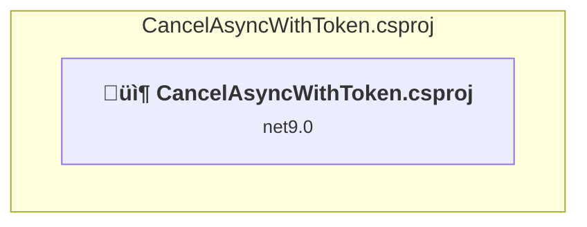

```mermaid
flowchart TB
    subgraph current["AsyncSpark.Tests.csproj"]
        MAIN["<b>📦&nbsp;AsyncSpark.Tests.csproj</b><br/><small>net9.0</small>"]
        click MAIN "#AsyncSparktestsAsyncSparktestscsproj"
    end
    subgraph downstream["Dependencies (1"]
        P1["<b>📦&nbsp;AsyncSpark.csproj</b><br/><small>net9.0</small>"]
        click P1 "#AsyncSparkAsyncSparkcsproj"
    end
    MAIN --> P1

```

```mermaid
flowchart TB
    subgraph current["AsyncSpark.Web.csproj"]
        MAIN["<b>📦&nbsp;AsyncSpark.Web.csproj</b><br/><small>net9.0</small>"]
        click MAIN "#AsyncSparkwebAsyncSparkwebcsproj"
    end
    subgraph downstream["Dependencies (2"]
        P1["<b>📦&nbsp;AsyncSpark.csproj</b><br/><small>net9.0</small>"]
        P4["<b>📦&nbsp;OpenWeatherMapClient.csproj</b><br/><small>net9.0</small>"]
        click P1 "#AsyncSparkAsyncSparkcsproj"
        click P4 "#openweathermapclientopenweathermapclientcsproj"
    end
    MAIN --> P1
    MAIN --> P4

```

```mermaid
flowchart TB
    subgraph upstream["Dependants (3)"]
        P2["<b>📦&nbsp;AsyncSpark.Tests.csproj</b><br/><small>net9.0</small>"]
        P3["<b>📦&nbsp;AsyncSpark.Console.csproj</b><br/><small>net9.0</small>"]
        P6["<b>📦&nbsp;AsyncSpark.Web.csproj</b><br/><small>net9.0</small>"]
        click P2 "#AsyncSparktestsAsyncSparktestscsproj"
        click P3 "#AsyncSparkconsoleAsyncSparkconsolecsproj"
        click P6 "#AsyncSparkwebAsyncSparkwebcsproj"
    end
    subgraph current["AsyncSpark.csproj"]
        MAIN["<b>📦&nbsp;AsyncSpark.csproj</b><br/><small>net9.0</small>"]
        click MAIN "#AsyncSparkAsyncSparkcsproj"
    end
    P2 --> MAIN
    P3 --> MAIN
    P6 --> MAIN

```

```mermaid
flowchart TB
    subgraph upstream["Dependants (1)"]
        P6["<b>📦&nbsp;AsyncSpark.Web.csproj</b><br/><small>net9.0</small>"]
        click P6 "#AsyncSparkwebAsyncSparkwebcsproj"
    end
    subgraph current["OpenWeatherMapClient.csproj"]
        MAIN["<b>📦&nbsp;OpenWeatherMapClient.csproj</b><br/><small>net9.0</small>"]
        click MAIN "#openweathermapclientopenweathermapclientcsproj"
    end
    P6 --> MAIN

```

# Projects and dependencies analysis

This document provides a comprehensive overview of the projects and their dependencies in the context of upgrading to .NET 9.0.

## Table of Contents

- [Projects Relationship Graph](#projects-relationship-graph)
- [Project Details](#project-details)

  - [AsyncSpark.Console\AsyncSpark.Console.csproj](#AsyncSparkconsoleAsyncSparkconsolecsproj)
  - [AsyncSpark.Tests\AsyncSpark.Tests.csproj](#AsyncSparktestsAsyncSparktestscsproj)
  - [AsyncSpark.Web\AsyncSpark.Web.csproj](#AsyncSparkwebAsyncSparkwebcsproj)
  - [AsyncSpark\AsyncSpark.csproj](#AsyncSparkAsyncSparkcsproj)
  - [CancelAsyncWithToken\CancelAsyncWithToken.csproj](#cancelasyncwithtokencancelasyncwithtokencsproj)
  - [OpenWeatherMapClient\OpenWeatherMapClient.csproj](#openweathermapclientopenweathermapclientcsproj)
- [Aggregate NuGet packages details](#aggregate-nuget-packages-details)

## Projects Relationship Graph

Legend:
📦 SDK-style project
⚙️ Classic project

```mermaid
flowchart LR
    P1["<b>📦&nbsp;AsyncSpark.csproj</b><br/><small>net9.0</small>"]
    P2["<b>📦&nbsp;AsyncSpark.Tests.csproj</b><br/><small>net9.0</small>"]
    P3["<b>📦&nbsp;AsyncSpark.Console.csproj</b><br/><small>net9.0</small>"]
    P4["<b>📦&nbsp;OpenWeatherMapClient.csproj</b><br/><small>net9.0</small>"]
    P5["<b>📦&nbsp;CancelAsyncWithToken.csproj</b><br/><small>net9.0</small>"]
    P6["<b>📦&nbsp;AsyncSpark.Web.csproj</b><br/><small>net9.0</small>"]
    P2 --> P1
    P3 --> P1
    P6 --> P1
    P6 --> P4
    click P1 "#AsyncSparkAsyncSparkcsproj"
    click P2 "#AsyncSparktestsAsyncSparktestscsproj"
    click P3 "#AsyncSparkconsoleAsyncSparkconsolecsproj"
    click P4 "#openweathermapclientopenweathermapclientcsproj"
    click P5 "#cancelasyncwithtokencancelasyncwithtokencsproj"
    click P6 "#AsyncSparkwebAsyncSparkwebcsproj"

```

## Project Details

### AsyncSpark.Console\AsyncSpark.Console.csproj

#### Project Info

- **Current Target Framework:** net9.0
- **Proposed Target Framework:** net10.0
- **SDK-style**: True
- **Project Kind:** DotNetCoreApp
- **Dependencies**: 1
- **Dependants**: 0
- **Number of Files**: 3
- **Lines of Code**: 171

#### Dependency Graph

Legend:
📦 SDK-style project
⚙️ Classic project

#### Project Package References

| Package | Type | Current Version | Suggested Version | Description |
| :--- | :---: | :---: | :---: | :--- |

### AsyncSpark.Tests\AsyncSpark.Tests.csproj

#### Project Info

- **Current Target Framework:** net9.0
- **Proposed Target Framework:** net10.0
- **SDK-style**: True
- **Project Kind:** DotNetCoreApp
- **Dependencies**: 1
- **Dependants**: 0
- **Number of Files**: 9
- **Lines of Code**: 241

#### Dependency Graph

Legend:
📦 SDK-style project
⚙️ Classic project

#### Project Package References

| Package | Type | Current Version | Suggested Version | Description |
| :--- | :---: | :---: | :---: | :--- |
| coverlet.collector | Explicit | 6.0.4 |  | ✅Compatible |
| Microsoft.Extensions.Caching.Abstractions | Explicit | 9.0.10 | 10.0.0 | NuGet package upgrade is recommended |
| Microsoft.Extensions.Caching.Memory | Explicit | 9.0.10 | 10.0.0 | NuGet package upgrade is recommended |
| Microsoft.Extensions.Http | Explicit | 9.0.10 | 10.0.0 | NuGet package upgrade is recommended |
| Microsoft.NET.Test.Sdk | Explicit | 18.0.0 |  | ✅Compatible |
| Moq | Explicit | 4.20.72 |  | ✅Compatible |
| MSTest.TestAdapter | Explicit | 4.0.1 |  | ✅Compatible |
| MSTest.TestFramework | Explicit | 4.0.1 |  | ✅Compatible |

### AsyncSpark.Web\AsyncSpark.Web.csproj

#### Project Info

- **Current Target Framework:** net9.0
- **Proposed Target Framework:** net10.0
- **SDK-style**: True
- **Project Kind:** AspNetCore
- **Dependencies**: 2
- **Dependants**: 0
- **Number of Files**: 55
- **Lines of Code**: 3870

#### Dependency Graph

Legend:
📦 SDK-style project
⚙️ Classic project

#### Project Package References

| Package | Type | Current Version | Suggested Version | Description |
| :--- | :---: | :---: | :---: | :--- |
| Azure.Identity | Explicit | 1.17.0 |  | ✅Compatible |
| Microsoft.Extensions.Diagnostics.HealthChecks.EntityFrameworkCore | Explicit | 9.0.10 | 10.0.0 | NuGet package upgrade is recommended |
| Microsoft.Extensions.Http.Resilience | Explicit | 9.10.0 |  | ✅Compatible |
| Polly | Explicit | 8.6.4 |  | ✅Compatible |
| Swashbuckle.AspNetCore | Explicit | 9.0.6 |  | ✅Compatible |
| Westwind.AspNetCore.Markdown | Explicit | 3.24.0 |  | ✅Compatible |

### AsyncSpark\AsyncSpark.csproj

#### Project Info

- **Current Target Framework:** net9.0
- **Proposed Target Framework:** net10.0
- **SDK-style**: True
- **Project Kind:** ClassLibrary
- **Dependencies**: 0
- **Dependants**: 3
- **Number of Files**: 12
- **Lines of Code**: 727

#### Dependency Graph

Legend:
📦 SDK-style project
⚙️ Classic project

#### Project Package References

| Package | Type | Current Version | Suggested Version | Description |
| :--- | :---: | :---: | :---: | :--- |
| Microsoft.Extensions.Caching.Abstractions | Explicit | 9.0.10 | 10.0.0 | NuGet package upgrade is recommended |
| Microsoft.Extensions.Http | Explicit | 9.0.10 | 10.0.0 | NuGet package upgrade is recommended |

### CancelAsyncWithToken\CancelAsyncWithToken.csproj

#### Project Info

- **Current Target Framework:** net9.0
- **Proposed Target Framework:** net10.0
- **SDK-style**: True
- **Project Kind:** DotNetCoreApp
- **Dependencies**: 0
- **Dependants**: 0
- **Number of Files**: 3
- **Lines of Code**: 118

#### Dependency Graph

Legend:
📦 SDK-style project
⚙️ Classic project

#### Project Package References

| Package | Type | Current Version | Suggested Version | Description |
| :--- | :---: | :---: | :---: | :--- |

### OpenWeatherMapClient\OpenWeatherMapClient.csproj

#### Project Info

- **Current Target Framework:** net9.0
- **Proposed Target Framework:** net10.0
- **SDK-style**: True
- **Project Kind:** ClassLibrary
- **Dependencies**: 0
- **Dependants**: 1
- **Number of Files**: 14
- **Lines of Code**: 864

#### Dependency Graph

Legend:
📦 SDK-style project
⚙️ Classic project

#### Project Package References

| Package | Type | Current Version | Suggested Version | Description |
| :--- | :---: | :---: | :---: | :--- |
| Azure.Identity | Explicit | 1.17.0 |  | ✅Compatible |
| Microsoft.AspNet.WebApi.Client | Explicit | 6.0.0 |  | ✅Compatible |
| Microsoft.EntityFrameworkCore.SqlServer | Explicit | 9.0.10 | 10.0.0 | NuGet package upgrade is recommended |
| Microsoft.EntityFrameworkCore.Tools | Explicit | 9.0.10 | 10.0.0 | NuGet package upgrade is recommended |
| Microsoft.Extensions.Http | Explicit | 9.0.10 | 10.0.0 | NuGet package upgrade is recommended |
| Microsoft.Extensions.Logging.Debug | Explicit | 9.0.10 | 10.0.0 | NuGet package upgrade is recommended |
| System.Drawing.Common | Explicit | 9.0.10 | 10.0.0 | NuGet package upgrade is recommended |
| System.Text.Json | Explicit | 9.0.10 | 10.0.0 | NuGet package upgrade is recommended |

## Aggregate NuGet packages details

| Package | Current Version | Suggested Version | Projects | Description |
| :--- | :---: | :---: | :--- | :--- |
| Azure.Identity | 1.17.0 |  | [AsyncSpark.Web.csproj](#AsyncSparkwebcsproj) [OpenWeatherMapClient.csproj](#openweathermapclientcsproj) | ✅Compatible |
| coverlet.collector | 6.0.4 |  | [AsyncSpark.Tests.csproj](#AsyncSparktestscsproj) | ✅Compatible |
| Microsoft.AspNet.WebApi.Client | 6.0.0 |  | [OpenWeatherMapClient.csproj](#openweathermapclientcsproj) | ✅Compatible |
| Microsoft.EntityFrameworkCore.SqlServer | 9.0.10 | 10.0.0 | [OpenWeatherMapClient.csproj](#openweathermapclientcsproj) | NuGet package upgrade is recommended |
| Microsoft.EntityFrameworkCore.Tools | 9.0.10 | 10.0.0 | [OpenWeatherMapClient.csproj](#openweathermapclientcsproj) | NuGet package upgrade is recommended |
| Microsoft.Extensions.Caching.Abstractions | 9.0.10 | 10.0.0 | [AsyncSpark.Tests.csproj](#AsyncSparktestscsproj) [AsyncSpark.csproj](#AsyncSparkcsproj) | NuGet package upgrade is recommended |
| Microsoft.Extensions.Caching.Memory | 9.0.10 | 10.0.0 | [AsyncSpark.Tests.csproj](#AsyncSparktestscsproj) | NuGet package upgrade is recommended |
| Microsoft.Extensions.Diagnostics.HealthChecks.EntityFrameworkCore | 9.0.10 | 10.0.0 | [AsyncSpark.Web.csproj](#AsyncSparkwebcsproj) | NuGet package upgrade is recommended |
| Microsoft.Extensions.Http | 9.0.10 | 10.0.0 | [AsyncSpark.Tests.csproj](#AsyncSparktestscsproj) [AsyncSpark.csproj](#AsyncSparkcsproj) [OpenWeatherMapClient.csproj](#openweathermapclientcsproj) | NuGet package upgrade is recommended |
| Microsoft.Extensions.Http.Resilience | 9.10.0 |  | [AsyncSpark.Web.csproj](#AsyncSparkwebcsproj) | ✅Compatible |
| Microsoft.Extensions.Logging.Debug | 9.0.10 | 10.0.0 | [OpenWeatherMapClient.csproj](#openweathermapclientcsproj) | NuGet package upgrade is recommended |
| Microsoft.NET.Test.Sdk | 18.0.0 |  | [AsyncSpark.Tests.csproj](#AsyncSparktestscsproj) | ✅Compatible |
| Moq | 4.20.72 |  | [AsyncSpark.Tests.csproj](#AsyncSparktestscsproj) | ✅Compatible |
| MSTest.TestAdapter | 4.0.1 |  | [AsyncSpark.Tests.csproj](#AsyncSparktestscsproj) | ✅Compatible |
| MSTest.TestFramework | 4.0.1 |  | [AsyncSpark.Tests.csproj](#AsyncSparktestscsproj) | ✅Compatible |
| Polly | 8.6.4 |  | [AsyncSpark.Web.csproj](#AsyncSparkwebcsproj) | ✅Compatible |
| Swashbuckle.AspNetCore | 9.0.6 |  | [AsyncSpark.Web.csproj](#AsyncSparkwebcsproj) | ✅Compatible |
| System.Drawing.Common | 9.0.10 | 10.0.0 | [OpenWeatherMapClient.csproj](#openweathermapclientcsproj) | NuGet package upgrade is recommended |
| System.Text.Json | 9.0.10 | 10.0.0 | [OpenWeatherMapClient.csproj](#openweathermapclientcsproj) | NuGet package upgrade is recommended |
| Westwind.AspNetCore.Markdown | 3.24.0 |  | [AsyncSpark.Web.csproj](#AsyncSparkwebcsproj) | ✅Compatible |

